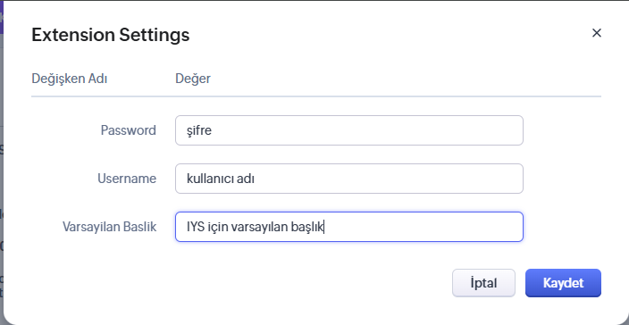

# ZOHO CRM – Verimor SMS Entegrasyonu

Bu eklenti ile Zoho CRM üzerinde bulunan kişi ve potansiyel müşterilere Verimor üzerinden tekil veya toplu SMS gönderebilirsiniz. Eklenti Zoho Marketplace'e özel plugin olarak yüklenir.

Modül adresi: ([Verimor SMS For ZOHO CRM](https://crm.zoho.com/market/installPrivatePlugin.do?portalName=verimortelekom&nameSpace=verimorsms&versionIndex=4576373000000167039))

## ZOHO CRM Nedir?

Zoho CRM, işletmelerin satış, pazarlama ve müşteri destek süreçlerini tek bir platformda yönetmesini sağlayan bulut tabanlı bir CRM uygulamasıdır.

## Özellikler
- Tekil veya toplu SMS gönderimi: Zoho'daki kişiler ve potansiyel müşterilere (leads/contacts) SMS gönderebilirsiniz.
- Manuel numara ekleyerek gönderim sağlayabilirsiniz.
- SMS bakiyenizi görüntüleyebilirsiniz.
- IYS modülüne sahipseniz ticari gönderim sağlayabilirsiniz.

## Kurulum
1. OIM içerisinde ([SMS Ayarlarım](https://oim.verimor.com.tr/sms_settings/edit)) ekranında
  - Api erişimini açın.
  - Api izinli IP ler alanına 135.84.80.0/24 adresini ekleyin.
  - Buradaki Kullanıcı ad ve API şifresini kopyalayın.
2. Verilen modül linkini açın ve Zoho Marketplace üzerinden eklentiyi yükleyin:
   ([Verimor SMS For ZOHO CRM](https://crm.zoho.com/market/installPrivatePlugin.do?portalName=verimortelekom&nameSpace=verimorsms&versionIndex=4576373000000167039))
2. Yükleme tamamlandıktan sonra Zoho içinde eklenti ayar formu açılacaktır.
3. Ayar formunda girilmesi gereken bilgiler:
   - SMS Ayarlarım dan kopyaladığınız yetkilendirilmiş API kullanıcı ve şifresi girin
   - 
4. Bağlantı başarılı ise bakiye bilginiz ayarlar ekranında görünecektir.Test SMS gönderimi yaparak doğrulama sağlayın.

Not: Eklenti kurulumunda Zoho tarafında gerekli izinleri vermeniz istenecektir; izinleri onaylayın.
## Kullanım

- Verimor SMS Gönder (Toplu) butonu: Seçilen birden fazla veriye SMS gönderimini sağlar
- Verimor SMS Gönder butonu: Detayı incelenen veriye SMS gönderimini sağlar.

## Örnek İş Akışı
1. Zoho içinde Lead veya Contact listesine gidin
2. SMS göndermek istediğiniz verileri seçin
3. Verimor SMS Gönder butonlarından birini seçin ve SMS gönderimi ekranını açın.
4. Gönderici başlığı seçin. Ticari gönderim için IYS başlığınız ile ilişkili başlığı seçmelisiniz
5. Gönderim Tipini seçin
6. SMS içeriğini girin ve gönderin.

## Destek
Kurulum veya gönderim sırasında sorun yaşarsanız lütfen Verimor destek ekibi ile iletişime geçin veya GitHub deposundaki dökümantasyona bakın.